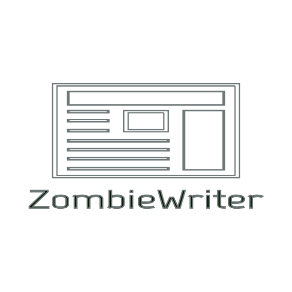

# ZombieWriter



ZombieWriter is a Ruby gem that will enable users to generate news articles by aggregating paragraphs from other sources.

While you have to provide the paragraphs, Zombie will arrange the paragraphs into different articles for you to use and edit to your heart's content. You may choose between Machine Learning (Latent Semantic Analysis and k-means clustering) or Randomization.

## Installation

### Command Line

```
gem install zombie_writer
```

### Gemfile

```ruby
gem 'zombie_writer'
```

## Usage
First, decide whether you want to use ZombieWriter::MachineLearning or ZombieWriter::Randomization. ZombieWriter::MachineLearning uses Latent Semantic Analysis and k-means clustering to group your content into different articles, while Randomization simply pick random paragraphs to put in each article.

ZombieWriter::MachineLearning has the potential of producing better-quality articles, but is slightly slower than ZombieWriter::Randomization.

To create a MachineLearning zombie...
```ruby
zombie = ZombieWriter::MachineLearning.new
```

And to create a Randomization zombie...
```ruby
zombie = ZombieWriter::Randomization.new
```

Then, once you have your zombie, add your content.
```ruby
zombie.add_string(content: "Lorem ipsum dolor sit amet.",
sourcetext: "Cicero's Great Speech On Ethics",
sourceurl: "http://example.com/lorem-ipsum")
```

In the generated article, this content will appear in Markdown as:
```markdown
Lorem ipsum dolor sit amet.--[Cicero's Great Speech On Ethics](http://example.com/lorem-ipsum)
```

If your content is located in an external file, such as a CSV file, you can easily automate the process of adding strings to your zombie.

```csv
Content,SourceText,SourceUrl
"Lorem ipsum dolor sit amet.","Cicero's Great Speech On Ethics","http://example.com/lorem-ipsum"
"Leverage agile frameworks.","Corporate Ipsum","http://www.cipsum.com/"
"Bacon ipsum dolor amet.","Bacon Ipsum","http://baconipsum.com/"
"Pork belly seitan photo booth.","Hipster Ipsum","https://hipsum.co/"
```

```ruby
require 'smarter_csv'

array_of_paragraphs = SmarterCSV.process("ipsum_quotes.csv")

array_of_paragraphs.each do |paragraph|
  zombie.add_string(paragraph)
end
```

Once you have finished giving your Zombie all the strings it needs, tell it to generate your articles. It will save them as an array, which you can then save elsewhere. Each article is numbered, starting from zero, and is also given an headline (which is the "most important sentence" in the article). All articles are formatted using Markdown.

```ruby
array = zombie.generate_articles

File.open("articles.md", "w+") do |f|
  array.each { |article| f.puts("#{article}<hr>\n") }
end
```

Here's an example article that might be generated by Zombie:

```markdown
<h2>0 - Lorem ipsum dolor sit amet.</h2>
Lorem ipsum dolor sit amet.---[Cicero's Great Speech On Ethics](http://example.com/lorem-ipsum)

Bacon ipsum dolor amet.---[Bacon Ipsum](http://baconipsum.com/)

Leverage agile frameworks.---[Corporate Ipsum](http://www.cipsum.com/)

Pork belly seitan photo booth.---[Hipster Ipsum](https://hipsum.co/)
<hr>
```

### Citation
You do not need to provide sourcetext or sourceurl. If you exclude the sourceurl, the article will only display the sourcetext as citation (with no hyperlink).

```ruby
zombie.add_string(content: "This is some Lorem filler that my friend made up.",
sourcetext: "tra38's anonymous friend")
```

```markdown
This is some Lorem filler that my friend made up.---tra38's anonymous friend
```

If you exclude the sourcetext, the article will use the sourceurl, while providing a hyperlink as well.

```ruby
zombie.add_string(content: "Zombie ipsum reversus ab viral inferno.",
sourceurl: "http://www.zombieipsum.com")
```

```markdown
Zombie ipsum reversus ab viral inferno.---[http://www.zombieipsum.com](http://www.zombieipsum.com)
```

If you exclude both the sourcetext and the sourceurl, the article will display no citation. This is useful for situations where you don't need to provide any citation metadata (such as if you have handwritten the content).
```ruby
zombie.add_string(content: "This is filler text that I invented.")
```

```markdown
This is filler text that I invented.
```

## Real-World Examples

### NaNoGenMo articles
The "National Novel Generation Month" competition has generated a lot of commentary on the Internet. Rather than hand-writing out new commentary, why not reuse existing ones?

- [Articles generated using ZombieWriter::MachineLearning](https://gist.github.com/tra38/aa7e9c63708f6e21c32db5c3616162b5)
- [Articles generated using ZombieWriter::Randomization](https://gist.github.com/tra38/a65408790642560498aa1d40a05be9fe)

In both instances, we used [this CSV file](https://gist.github.com/tra38/805003ef51ff63093b3c2775f161ce3c) as source data.

## Development

After checking out the repo, run `bin/setup` to install dependencies. Then, run `rake spec` to run the tests. You can also run `bin/console` for an interactive prompt that will allow you to experiment. Run `bundle exec zombie_writer` to use the gem in this directory, ignoring other installed copies of this gem.

To install this gem onto your local machine, run `bundle exec rake install`. To release a new version, update the version number in `version.rb`, and then run `bundle exec rake release`, which will create a git tag for the version, push git commits and tags, and push the `.gem` file to [rubygems.org](https://rubygems.org).

## Contributing

1. Fork it ( https://github.com/tra38/zombie/fork )
2. Create your feature branch (git checkout -b my-new-feature)
3. Commit your changes (git commit -am 'Add some feature')
4. Push to the branch (git push origin my-new-feature)
5. Create a new Pull Request

## License

The gem is available as open source under the terms of the [MIT License](http://opensource.org/licenses/MIT).

## Credits
The name is inspired by the term "[Philosphical Zombie](https://en.wikipedia.org/wiki/Philosophical_zombie)". According to Wikipedia, a P-Zombie is "a hypothetical being that is indistinguishable from a normal human being except that it lacks conscious experience, qualia, or sentience". AI is the closest we can get to building a P-Zombie of our own.

The logo for this project was generated using [MarkMaker](http://emblemmatic.org/markmaker/#/).